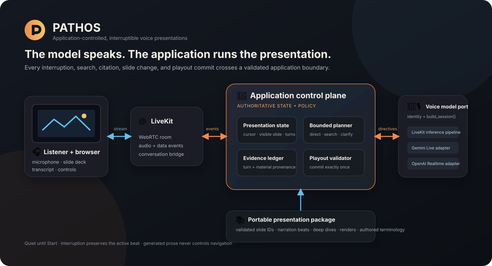

# Pathos

**An application-controlled, interruptible voice agent for presenting and
reasoning over slide decks.**

Pathos narrates an authored presentation, accepts spoken interruptions, searches
bounded presentation material when needed, and resumes without losing its place.
The language model speaks and plans; deterministic application code owns state,
navigation, evidence validation, and narration commitment.



## What Pathos does

- Starts quietly: no room, microphone, or model session exists before **Start**.
- Narrates a visual deck while the listener browses slides independently.
- Stops promptly for spoken interruption without committing unfinished narration.
- Resolves follow-ups from retained conversation, current-slide evidence, or up
  to two bounded searches over the packaged deck.
- Discloses whether an answer is grounded, extended model knowledge, a
  clarification request, or out of scope.
- Validates turn citations and deck evidence before generating an answer.
- Waits after answers by default; explicit “answer and continue” resumes only
  after verified answer playout.
- Records private local traces for timing, usage, provider-reported cache tokens,
  selected evidence, and application decisions.

The included six-slide motorcycle presentation is a reference content package,
not a hard-coded topic boundary. Other presentations can use the same runtime
when authored into the normalized package described below.

## Architecture

Pathos separates the generative voice loop from the authoritative presentation
control plane:

1. The React browser publishes microphone audio and receives speech, transcript,
   slide state, and diagnostics through LiveKit.
2. The LiveKit bridge translates provider events into correlated application
   turns and playout facts.
3. The application session validates every transition, maintains separate
   visible and semantic slide positions, and issues provider-neutral generation
   directives.
4. A bounded silent planner either answers from retained context, searches the
   packaged deck, requests clarification, discloses model knowledge, or returns
   an out-of-scope boundary.
5. A small voice-model port constructs the selected backend. The verified
   default is Deepgram Nova-3 + Gemma 4 + Inworld TTS through LiveKit Inference;
   Gemini Live and OpenAI Realtime are optional comparison adapters.

Narration advances only after the active turn, purpose, cursor, and completed
audio playout all match. Generated prose is never parsed to control slides.

Read [How Pathos works](docs/concepts.md) for the state, interruption, reasoning,
answer-mode, evidence, and content contracts.

## Why Pathos

- **Replaceable voice backend:** provider factories implement one small session
  construction protocol while credentials and SDK details stay in adapters.
- **Application-owned behavior:** interruption, continuation, navigation, and
  exactly-once commitment are explicit state transitions rather than prompt
  conventions.
- **Bounded reasoning:** direct context answers avoid search; harder questions
  can use deterministic local retrieval within fixed tool and time budgets.
- **Validated provenance:** logical turns and material segments have stable IDs
  that are checked before an answer may cite them.
- **Portable deck contract:** stable slide/beat IDs, narration guidance, deep
  dives, terminology, visual descriptions, and renders drive the same runtime.
- **Evaluation-ready:** deterministic race tests and attempt-scoped local traces
  make provider behavior inspectable without exposing fake product endpoints.
- **Cache-aware, not cache-dependent:** stable context and provider-reported
  cached-token metrics leave room to measure latency and cost without promising
  cache hits.

See the concise [advantages](docs/advantages.md) and honest
[limitations](docs/limitations.md).

## Demo

<!-- DEMO_VIDEO_PLACEHOLDER -->

> Demo video coming soon. Replace this block with the reviewed public recording.

For a repeatable five-minute walkthrough now, use the
[public demo script](docs/demo-script.md). It covers interruption, grounded
follow-ups, answer-and-continue, browsing during an answer, and completion.

## Quick start

### Prerequisites

- macOS or Linux
- an active conda environment with Python 3.12
- Node.js compatible with Vite 8 and npm
- a LiveKit Cloud project and API credentials

The default pipeline consumes LiveKit Inference credits. Provider availability
and pricing can change, so confirm the selected models in your LiveKit project.

### 1. Clone and install

```bash
git clone https://github.com/Rainet473/pathos.git
cd pathos

# Activate your existing Python 3.12 conda environment first.
python -m pip install -e ".[test]"

cd frontend
npm ci
cd ..
```

If you do not already have a suitable environment, create and activate one
before installing:

```bash
conda create -n voice-presentation python=3.12
conda activate voice-presentation
```

### 2. Configure the live provider

```bash
cp .env.example .env
```

Set the required values in `.env`:

```dotenv
LIVEKIT_URL=wss://your-project.livekit.cloud
LIVEKIT_API_KEY=...
LIVEKIT_API_SECRET=...
VOICE_PROVIDER=livekit_inference_pipeline
```

The default pipeline needs no separate Google or OpenAI key. Never commit
`.env`.

### 3. Run Pathos

Keep the same conda environment active in both terminals.

Terminal 1:

```bash
./scripts/run-backend.sh
```

Terminal 2:

```bash
./scripts/run-frontend.sh
```

Open <http://localhost:5173>. The page remains quiet and disconnected until
**Start presentation**. Use headphones when testing interruption.

### 4. Verify the checkout

```bash
./scripts/check.sh
```

The gate compiles Python, runs deterministic backend and frontend tests, checks
installed Python dependencies, type-checks the frontend, and builds the
production bundle. Paid provider observations remain opt-in.

## Voice backend options

| `VOICE_PROVIDER` | Role | Extra dependency / credential |
|---|---|---|
| `livekit_inference_pipeline` | Verified release default: Deepgram STT, Gemma LLM, Inworld TTS | LiveKit credentials only |
| `gemini_live` | Optional Gemini Live comparison adapter | `.[gemini-realtime]` and `GOOGLE_API_KEY` |
| `openai_realtime` | Optional OpenAI Realtime comparison adapter | `.[openai-realtime]` and `OPENAI_API_KEY` |

Install an optional adapter with the test dependencies when developing:

```bash
python -m pip install -e ".[test,gemini-realtime]"
# or
python -m pip install -e ".[test,openai-realtime]"
```

The adapters share the `VoiceSessionFactory` port, but LiveKit remains the
current realtime transport and orchestration layer. Provider-specific VAD,
endpointing, voices, and SDK construction stay explicit in each adapter.

## Using another presentation

The runtime loads `assets/<deck-id>/slide-breakdown.json` plus slide renders. A
package supplies stable slide and beat IDs, objectives, narration guidance,
required concepts, deep dives, caveats, related terms, textual visual
descriptions, and asset metadata.

Any reviewed deck that follows this validated contract can reuse the controller,
planner, evidence validation, and browser. Raw PPTX/PDF import is not implemented;
authoring the normalized package is currently a deliberate manual step. See
[How Pathos works](docs/concepts.md#presentation-content-contract) and the
[limitations](docs/limitations.md#raw-slide-decks-are-not-plug-and-play).

## Documentation

| Document | Purpose |
|---|---|
| [How Pathos works](docs/concepts.md) | Conceptual model, state ownership, interruption, reasoning, answer modes, evidence, and content |
| [Advantages](docs/advantages.md) | Reusable implementation choices and their practical value |
| [Limitations](docs/limitations.md) | Current technical and evidence boundaries |
| [Architecture](docs/architecture.md) | Module-level structure and dependency direction |
| [Demo script](docs/demo-script.md) | Concise public walkthrough and success rubric |
| [Known issues](observations/known-issues.md) | Observed behavior, mitigations, and deferred refinements |
| [Assignment handoff](docs/assignment-handoff.md) | Delivery boundary and verification state |
| [Contributing](CONTRIBUTING.md) | Engineering workflow and contribution expectations |

## Development and verification

The configured production HTTP surface contains only:

- `GET /api/health`
- `GET /api/decks/{deck_id}/slides/{slide_id}/render`
- `POST /api/live/sessions`

There are no fake or transport-probe product endpoints. Tests use the same
application session as the live runtime with lightweight collaborators at SDK
boundaries.

To summarize a retained attempt’s planning cache, search latency, endpointing,
and answer-scoped pipeline timing:

```bash
PYTHONPATH=backend/src python -m voice_presentation.transport.reasoning_evidence \
  .runtime/conversation-diagnostics.jsonl --attempt-id <attempt-id>
```

Cached-token values are provider-reported. Zero is a valid result, and older
records without a turn purpose remain explicitly unscoped.

The opt-in LiveKit audio-transport smoke spends provider quota:

```bash
set -a
source .env
set +a
RUN_LIVEKIT_TESTS=1 python -m pytest -q tests/live/test_livekit_audio_transport.py
```

## Repository layout

```text
assets/                  normalized presentation packages and slide renders
backend/src/             domain, application, transport, and provider adapters
docs/                    public concepts, architecture, guides, and handoff
frontend/src/            live React client and deterministic reducer tests
expectations/            behavior specified before implementation
observations/            verified slice evidence and known issues
scripts/                 active-environment launch and release checks
tests/                   deterministic contracts and opt-in live boundaries
```

## Privacy

`.env`, `.runtime/`, microphone transcripts, and model-context captures are
ignored and must not be committed. Retain recordings privately when they contain
voice or transcript data; publish only reviewed, intentionally sanitized
artifacts.

## License

No software license has been selected yet. The code is source-visible, but
redistribution and reuse terms require an explicit owner decision before a public
release is declared complete.
