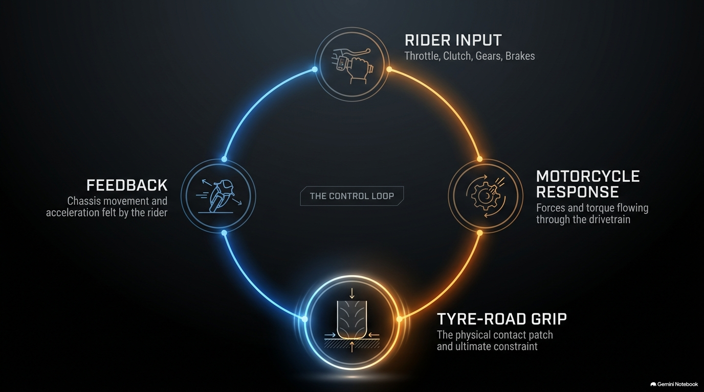

# Interruptible Voice Presentation

An application-controlled voice presenter that narrates a browsable slide deck,
answers spoken questions, survives interruption, and advances only after audio
playout is verified.



The current release uses a LiveKit three-model pipeline—Deepgram Nova-3 for
speech recognition, Gemma 4 for generation, and Inworld TTS. The domain model is
provider-independent: LiveKit and model SDKs remain in adapters, while
application code owns the presentation cursor, visible slide, answer mode, and
commit rules.

## What is implemented

- Quiet start: no microphone, room, or model session before **Start**.
- Six-slide visual deck with listener-controlled browsing.
- Voice interruption without accidentally committing an unfinished beat.
- Grounded, extended-knowledge, clarification, and out-of-scope answer modes.
- Default wait after an answer, with explicit answer-and-continue permission.
- Separate visible-slide and semantic presentation cursors.
- Verified playout completion before a narration beat advances.
- Two-minute inactivity cleanup and a fifteen-minute absolute session ceiling.
- Private local usage, timing, transcript-context, and lifecycle diagnostics.
- Deterministic application/domain coverage for presentation behavior, plus a
  small opt-in direct LiveKit audio-transport smoke test.

## Requirements

- macOS or Linux
- an active conda environment with Python 3.12
- Node.js compatible with Vite 8 and npm
- a LiveKit Cloud project

The default pipeline consumes LiveKit Inference credits and does not require a
Google or OpenAI key. Provider prices and model availability can change; check
your LiveKit project before running paid observations.

## Local setup

Run all commands from the repository root and keep the same conda environment
active in both terminals.

```bash
python -m pip install -e ".[test]"
cd frontend
npm ci
cd ..
cp .env.example .env
```

Fill these values in `.env`:

```dotenv
LIVEKIT_URL=wss://your-project.livekit.cloud
LIVEKIT_API_KEY=...
LIVEKIT_API_SECRET=...
VOICE_PROVIDER=livekit_inference_pipeline
```

Start the backend and frontend separately:

```bash
./scripts/run-backend.sh
```

```bash
./scripts/run-frontend.sh
```

Open <http://localhost:5173>. The page stays disconnected until **Start** is
pressed. Use headphones when testing interruption.

## Optional realtime adapters

The Gemini and OpenAI realtime implementations are comparison adapters, not
default dependencies or the release provider. Install only the one you intend
to use:

```bash
python -m pip install -e ".[test,gemini-realtime]"
# or
python -m pip install -e ".[test,openai-realtime]"
```

Then set `VOICE_PROVIDER` to `gemini_live` or `openai_realtime` and provide its
corresponding API key. Provider-specific imports are lazy, so the default
pipeline does not require either plugin.

## Production HTTP surface

The configured backend registers only:

- `GET /api/health`
- `GET /api/decks/{deck_id}/slides/{slide_id}/render`
- `POST /api/live/sessions`

There are no fake or transport-probe product endpoints. Tests exercise the same
application session used by the live runtime, with lightweight collaborators at
external SDK boundaries.

## Verification

The complete local gate is:

```bash
./scripts/check.sh
```

It compiles the Python package, runs all deterministic Python and frontend
tests, checks installed Python dependencies, and builds the production web
bundle. Paid external-provider observations remain opt-in and are not implied by
an offline green gate.

To isolate the LiveKit media path without invoking STT, LLM, or TTS models,
export the `.env` values and run the small opt-in audio smoke:

```bash
set -a
source .env
set +a
RUN_LIVEKIT_TESTS=1 python -m pytest -q tests/live/test_livekit_audio_transport.py
```

## Repository map

```text
assets/                  packaged deck source, runtime manifest, and renders
backend/src/             domain, application, transport, and provider adapters
frontend/src/            live browser client and deterministic reducer tests
expectations/            behavior specified before implementation
observations/            exit evidence and explicitly deferred issues
scripts/                 active-environment launch and release checks
tests/                   deterministic contracts and adapter boundaries
```

Earlier slice records describe now-retired fake and record/replay scaffolding;
they remain only as historical evidence, not current setup instructions.

See [Architecture](docs/architecture.md), [Contributing](CONTRIBUTING.md), and
the [known-issues ledger](observations/known-issues.md) before changing state,
playout, navigation, or answer-resolution behavior.

## Privacy and limitations

`.env`, `.runtime/`, microphone transcripts, and model-context captures are
ignored and must not be committed. Sanitized evidence belongs under
`observations/`.

The packaged PPTX is preserved as an authoring source, but generic deck import
is intentionally not implemented. Short referential questions can also lose
their conversational antecedent; see KI-006. These limits are recorded rather
than concealed behind model behavior.

## License

No software license has been selected yet. The code is source-visible in this
repository, but redistribution and reuse terms require an explicit owner
decision before a public release is declared complete.
