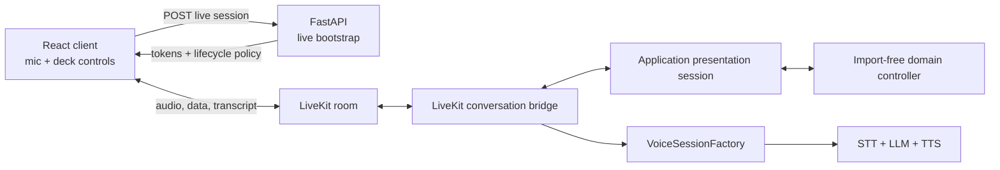
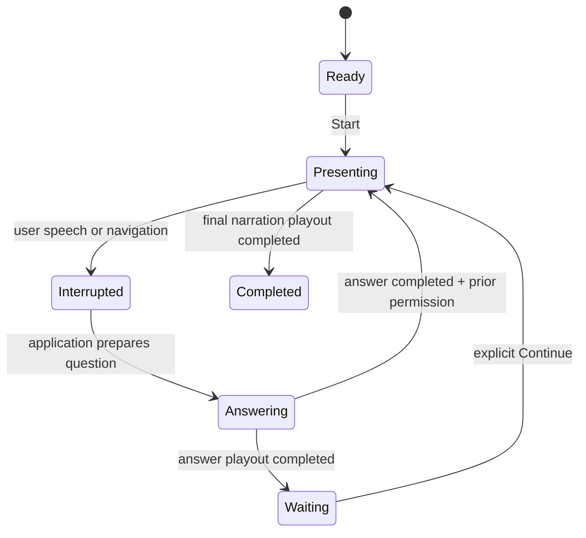

# Architecture

## Design centre

The model speaks; it does not run the presentation. Application code chooses
the next narration beat, validates every transition, selects answer evidence,
and commits progress only after the associated audio playout completes.



The dependency direction points inward: domain code imports no LiveKit,
OpenAI, Google, or browser SDK. Provider adapters implement the small
`VoiceSessionFactory` protocol.

## Two slide positions

`visible_slide_id` is what the listener is browsing. `presentation_cursor` is
the semantic narration position. They normally move together, but manual
browsing can separate them without skipping or committing narration.

```text
listener browses slide 2
        |
        +--> visible slide = slide 2
        +--> active narration is interrupted
        +--> presentation cursor remains slide 4 / beat 3
```

A relevant question may prefer the visible slide as retrieval context, while
the whole packaged deck remains the bounded fallback. Generated text is never
parsed to choose navigation.

## Playout is the commit boundary



Selection and playback are not commitment. A narration beat commits exactly
once only when the active turn, purpose, cursor, and verified playout completion
all match. Late callbacks become stale events rather than advancing state.

## Runtime layers

- `domain/`: presentation state, transitions, content contracts, and events.
- `application/`: use cases that coordinate the domain and bounded deck
  evidence.
- `transport/`: HTTP/data-channel schemas, lifecycle policy, transcripts,
  diagnostics, and usage records.
- `adapters/livekit/`: tokens, room orchestration, provider factories, and
  LiveKit event translation.
- `server/`: production and explicit harness application composition.

The larger LiveKit bridge is orchestration code. Launcher lifecycle and agent
construction are split into `conversation_launcher.py` and
`conversation_agent.py`; the remaining bridge keeps correlated room, transcript,
playout, navigation, and shutdown behavior together.

## Provider factory layout

```text
adapters/livekit/agents/
  base.py                 shared validation, identity, safe representation
  inference_pipeline.py   verified Deepgram + Gemma + Inworld pipeline
  gemini_realtime.py      optional Gemini Live adapter
  openai_realtime.py      optional OpenAI Realtime adapter
```

The base is intentionally small. It does not manufacture a broad inheritance
framework for options that merely look similar: endpointing, VAD, credentials,
and SDK constructors have different provider semantics and remain explicit in
each adapter. This makes capability differences visible during review.

## Production and regression composition

`create_configured_app()` mounts health, deck rendering, and the live session
bootstrap. Tests can call `create_app()` with a fake store or transport bootstrap
service to mount internal harness endpoints. The contracts are retained; their
routes are not accidentally exposed by production configuration.

## Content package

The runtime consumes `assets/<deck-id>/slide-breakdown.json` and slide renders.
`deck.pptx` is a preserved authoring source, not a state model. A future importer
must normalize and validate a supplied deck before the runtime sees it.
