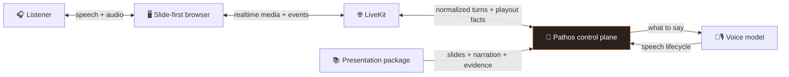
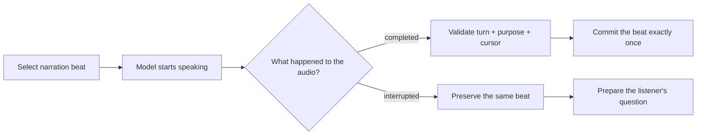
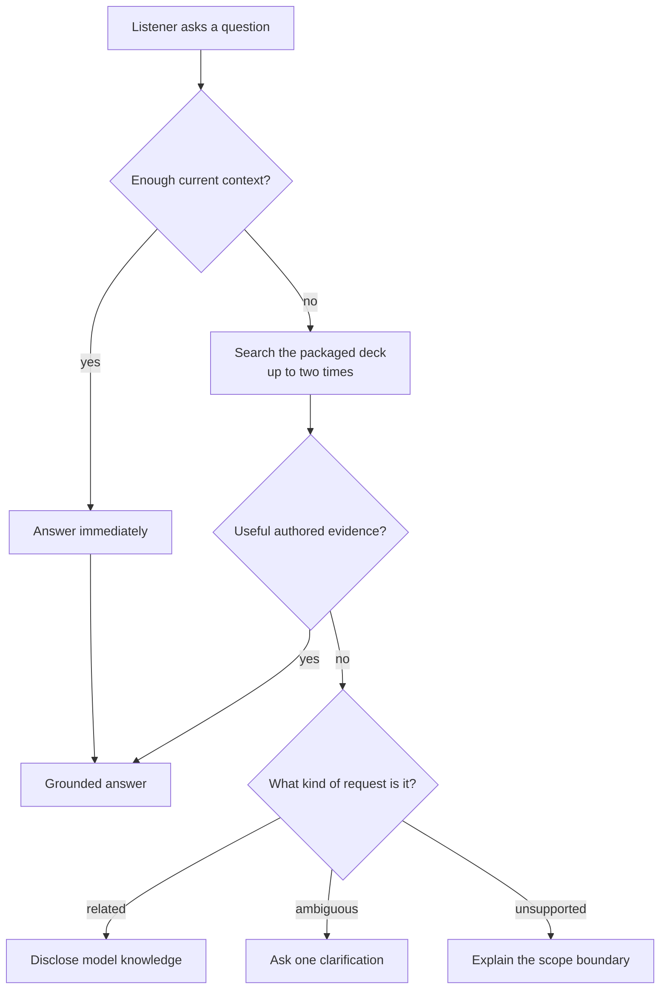

# How Pathos works

Pathos is easier to understand as a presentation system with a voice, not as a
chatbot with slides attached. The model can listen, reason, and speak, while the
application decides what is allowed to happen to the presentation.

## The system at a glance



The important boundary is the orange box: the model produces language, but
Pathos owns state, navigation, evidence, and progress.

## Core concepts

These five ideas explain most of the repository.

### 1. The application is the presenter

Think of the voice model as the speaker and Pathos as the stage manager. The
model can explain a topic, but it cannot skip a slide, mark narration complete,
or decide that an interruption has been handled. It receives a specific speaking
instruction from the application and reports what happened afterward.

This keeps presentation behavior testable even when a model response is
probabilistic.

### 2. The deck has two positions

Pathos remembers two locations:

| Position | Human meaning |
|---|---|
| **Visible slide** | The slide the listener is currently looking at |
| **Presentation cursor** | The slide and narration beat where the presenter belongs |

Normally they point to the same slide. If the listener browses elsewhere, only
the visible position moves. Continue returns to the presentation cursor, so
exploration does not silently skip narration.

### 3. A spoken turn is not a committed beat

Selecting narration and actually finishing it are different events. Pathos
commits a beat only after the matching audio playout completes.



Late or duplicate callbacks cannot advance the deck because the active turn,
purpose, cursor, and completion event must all agree.

### 4. Questions take one of four paths

The planner does not search automatically. It first asks whether the active
conversation and current slide already provide enough support. Search is a
bounded fallback, not the default response path.



These branches become four answer modes:

| Mode | What the listener should understand |
|---|---|
| `grounded` | The answer is supported by the conversation, presentation, or both |
| `extended_knowledge` | The topic is related, but the answer comes from disclosed model knowledge |
| `needs_clarification` | Pathos needs one detail before it can answer safely |
| `out_of_scope` | The request is outside the presentation contract |

### 5. Evidence must be valid before the model speaks

Every retained conversation turn and searchable material segment has a stable
identifier. A plan may cite only identifiers that are eligible for the current
question. Pathos checks those references before creating the speaking
instruction.

These citations are internal provenance for debugging and evaluation, not
footnotes read aloud to the listener. The logs show selected evidence and
application decisions without storing hidden model reasoning.

## What happens during an interruption

1. The active speech handle is interrupted.
2. The unfinished narration beat stays at the presentation cursor.
3. The application checks whether the final user transcript is a short,
   standalone continuation command.
4. “Continue the presentation,” “resume narration,” and other bounded variants
   restore and replay the preserved beat directly. They do not invoke the
   planner or create an answer turn.
5. Otherwise, the transcript becomes a logical follow-up and the silent planner
   chooses one of the question paths above.
6. The answer is validated and spoken as its own turn. Pathos waits by default,
   or resumes after playout when the listener explicitly asked to “answer and
   continue.”

During follow-up preparation, the browser renders an application-visible path:
**Understand → Search if needed → Prepare → Answer**. Only stages actually
published by the application are marked complete; Search is shown as skipped for
a direct-context answer. This is operational progress, not model chain-of-thought.

Browsing during an answer cancels direct resumption and leaves the presentation
waiting. Generated phrases such as “let us move on” are never parsed as
navigation commands.

## Replaceable voice-model port

The application uses a small `VoiceSessionFactory` contract rather than calling
a provider constructor directly:

```python
class VoiceSessionFactory(Protocol):
    @property
    def identity(self) -> VoiceBackendIdentity: ...

    def build_session(self, *, instructions: str) -> object: ...
```

The verified default builds the LiveKit Inference pipeline. Optional factories
build Gemini Live or OpenAI Realtime sessions. Provider credentials, voices,
endpointing, and SDK construction stay inside their adapters. LiveKit remains
the realtime transport; the port makes the voice model replaceable, not the
entire media stack.

## Presentation content contract

Runtime content is a reviewed package under `assets/<deck-id>/` containing:

- stable slide and narration-beat IDs;
- slide headlines, labels, and visual descriptions;
- narration guidance and required concepts;
- deep-dive explanations, caveats, and related terms; and
- slide renders used by the browser.

A new deck that follows this contract can reuse the controller, planner,
evidence validation, and UI. Raw PPTX or PDF import is not automatic yet; the
normalized package must currently be authored and reviewed before runtime.

## Where to look in the code

| Layer | Responsibility |
|---|---|
| `domain/` | presentation state and valid transitions |
| `application/` | use cases, evidence selection, and speaking directives |
| `adapters/livekit/` | provider construction and LiveKit event translation |
| `transport/` | public schemas, diagnostics, transcripts, and lifecycle records |
| `frontend/` | application-state rendering and listener controls |

For module-level dependencies and deployment composition, continue to the
[architecture guide](architecture.md). For the product boundaries, read the
[limitations](limitations.md).
